# Document Image Classification

This project develops a machine learning model to classify scanned document images into five predefined categories (0, 2, 4, 6, 9), leveraging both image data and OCR text.

## Dataset

- **Overview**: 2500 scanned documents split into 5 classes (500 per class), creating a balanced dataset
- **Classes**: 0, 2, 4, 6, 9 (representing different document types)
- **Data Types**:
  - **Images**: Black and white TIF format, located in `data/images/{class_name}/*.TIF`
  - **OCR Text**: Corresponding text data in `data/ocr/{class_name}/*.TIF.txt`
- **Exploratory Data Analysis**: See [`notebooks/eda.ipynb`](notebooks/eda.ipynb) for a comprehensive analysis of image properties and text characteristics

## Project Structure

```text
ML/
├── data/                      # Data directory
│   ├── images/                # TIF image files by class (0, 2, 4, 6, 9)
│   └── ocr/                   # OCR text files by class (0, 2, 4, 6, 9)
├── models/                    # Saved model checkpoints
│   ├── image_baseline_best.pt # Best image model checkpoint
│   ├── text_baseline_best.pkl # Best text model checkpoint
│   ├── tfidf_vectorizer.pkl   # Fitted TF-IDF vectorizer
│   └── multimodal_best.pt     # Best multimodal model checkpoint
├── notebooks/                 # Jupyter notebooks
│   └── eda.ipynb              # Exploratory Data Analysis
├── results/                   # Results and evaluation outputs
│   ├── image_baseline/        # Image model results
│   │   ├── training_metrics.csv
│   │   ├── training_history.png
│   │   ├── image_baseline_eval.txt
│   │   ├── confusion_matrix.png
│   │   └── confusion_matrix_normalized.png
│   ├── text_baseline/         # Text model results
│   │   ├── tfidf_feature_importance.png
│   │   ├── confusion_matrix.png
│   │   ├── class_performance.png
│   │   └── text_features_info.txt
│   ├── multimodal/            # Multimodal model results
│   │   ├── training_metrics.csv
│   │   ├── training_history.png
│   │   ├── learning_rate.png
│   │   ├── confusion_matrix.png
│   │   ├── confusion_matrix_normalized.png
│   │   ├── test_confusion_matrix.png
│   │   ├── test_confusion_matrix_normalized.png
│   │   ├── test_class_performance.png
│   │   └── multimodal_eval.txt
│   ├── text_baseline_eval.txt
│   ├── text_lr_gridsearch.csv
│   ├── preprocessing/
│   │   ├── text_preprocessing_results.csv
│   │   ├── text_preprocessing_summary.md
│   │   ├── top_tokens.png
│   │   ├── token_count_distribution.png
│   │   ├── avg_tokens_by_class.png
│   │   └── sample_*.png
│   └── splits/
│       ├── train.csv
│       ├── val.csv
│       ├── test.csv
│       ├── class_distribution.png
│       └── split_summary.md
├── src/
│   ├── features/
│   │   └── text_features.py
│   ├── models/
│   │   ├── image_model.py
│   │   ├── text_model.py
│   │   └── multimodal_model.py
│   ├── training/
│   │   ├── train_image.py
│   │   ├── train_image_model.py
│   │   ├── train_text_model.py
│   │   ├── evaluate_text_model.py
│   │   └── train_multimodal.py
│   ├── data_loader.py
│   ├── data_loader_multimodal.py
│   ├── preprocessing.py
│   ├── dataset_split.py
│   └── test_dataset_split.py
├── test_data_loaders.py
├── test_image_model.py
├── test_text_features.py
├── test_multimodal_data_loader.py
├── train_model.py
├── run_baseline_image_model.sh
├── run_text_baseline.sh
├── run_evaluation.sh
├── run_text_features.sh
├── run_multimodal_model.sh
├── requirements.txt
└── README.md
```

## Setup

1. Clone the repository
2. Create a virtual environment: `python -m venv venv`
3. Activate the environment:
   - **Windows**: `venv\Scripts\activate`
   - **Mac/Linux**: `source venv/bin/activate`
4. Install dependencies: `pip install -r requirements.txt`
5. Download required NLTK data (used for text preprocessing like stop-word removal):

```python
import nltk
nltk.download('stopwords')
nltk.download('punkt')
nltk.download('wordnet')
```

6. Download required spaCy model (used for lemmatization during text preprocessing):

```bash
python -m spacy download en_core_web_sm
```

## Usage

The primary way to run the different model pipelines (preprocessing, training, evaluation) is via the provided shell scripts (`run_*.sh`). You can also execute the individual Python scripts for specific steps or debugging.

### Data Exploration

```bash
jupyter lab notebooks/eda.ipynb
```

### Dataset Splitting

```bash
# Generates train/val/test splits (results saved in results/splits/)
python src/test_dataset_split.py
```

### Image Model Training and Evaluation

```bash
# Run the full image baseline pipeline (training & evaluation)
bash run_baseline_image_model.sh

# Or run individual steps:
python test_data_loaders.py  # Test image data loading
python train_model.py        # Train image model (requires manual config)
bash run_evaluation.sh       # Evaluate the trained image model
```

### Text Model Training and Evaluation

```bash
# Run the full text baseline pipeline (feature extraction, training & evaluation)
bash run_text_baseline.sh

# Or run individual steps:
bash run_text_features.sh     # Generate TF-IDF features
python test_text_features.py  # Visualize text features
# (Training/evaluation is handled by run_text_baseline.sh which calls Python scripts)
```

### Multimodal Model Training and Evaluation

```bash
# Run the full multimodal pipeline (training & evaluation)
bash run_multimodal_model.sh

# Or run individual steps:
python test_multimodal_data_loader.py  # Test multimodal data loading
# (Training/evaluation is handled by run_multimodal_model.sh which calls Python scripts)
```

## Current Status

**[COMPLETED]** - All baseline models and the final multimodal model have been trained and evaluated. The multimodal approach demonstrated the best performance. Results and model checkpoints are available in the `results/` and `models/` directories respectively.

## Model Architecture and Performance

### Image Baseline Model
- **Architecture**: EfficientNet‑B0 (pre‑trained) with custom classifier head
- **Approach**: Transfer learning with frozen backbone
- **Regularization**: Dropout (0.2) to prevent overfitting
- **Training**: Learning‑rate scheduling & early stopping

**Architecture Diagram**

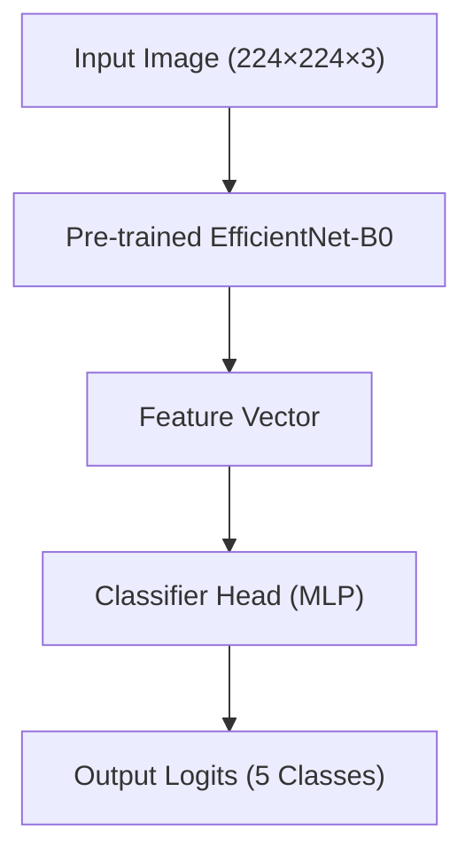


#### Performance

| Metric | Score |
|--------|-------|
| **Accuracy** | **81.33 %** |
| **Macro F1** | **0.81** |

**Per‑class results**

| Class | Precision | Recall | F1 |
|-------|-----------|--------|----|
| 0 | 0.85 | 0.88 | 0.86 |
| 2 | 0.88 | 0.91 | 0.89 |
| 4 | 0.78 | 0.87 | 0.82 |
| 6 | 0.79 | 0.76 | 0.78 |
| 9 | 0.75 | 0.65 | 0.70 |

**Confusion Matrix**


**Normalized Confusion Matrix**

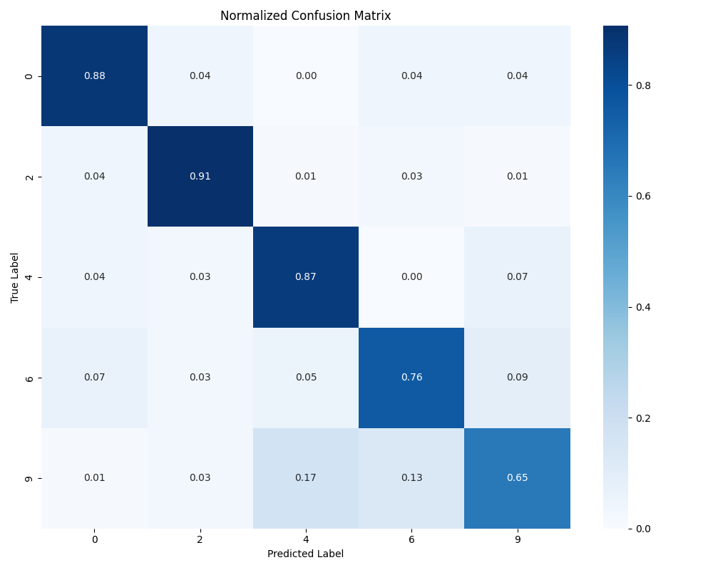

**Training History**

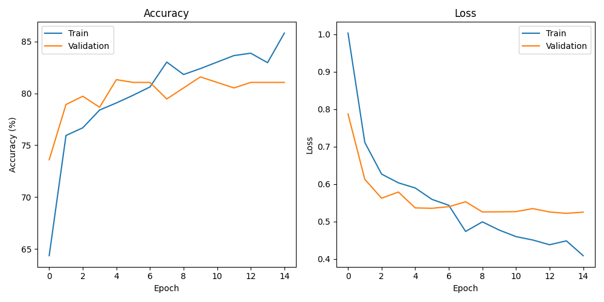

### Text Baseline Model
- **Architecture**: Logistic Regression with one-vs-rest strategy
- **Features**: TF‑IDF vectorization (10,000 features)
- **Hyperparameter Tuning**: Grid search with cross-validation
  - **Best Parameters**: C=10, penalty='l2', class_weight=None
  - **Best CV Score**: 0.8425

**Architecture Diagram**
```mermaid
graph TD
  A[Input Text] --> B(TF-IDF Vectorizer)
  B --> C{Feature Vector (10k dims)}
  C --> D[Logistic Regression]
  D --> E[Output Probabilities (5 Classes)]
```

#### Performance

| Metric | Score |
|--------|-------|
| **Accuracy** | **83.20%** |
| **Macro F1** | **0.8323** |

**Per‑class results**

| Class | Precision | Recall | F1 |
|-------|-----------|--------|----|
| 0 | 0.88 | 0.88 | 0.88 |
| 2 | 0.96 | 0.85 | 0.90 |
| 4 | 0.73 | 0.92 | 0.81 |
| 6 | 0.89 | 0.83 | 0.86 |
| 9 | 0.75 | 0.68 | 0.71 |

**Confusion Matrix**

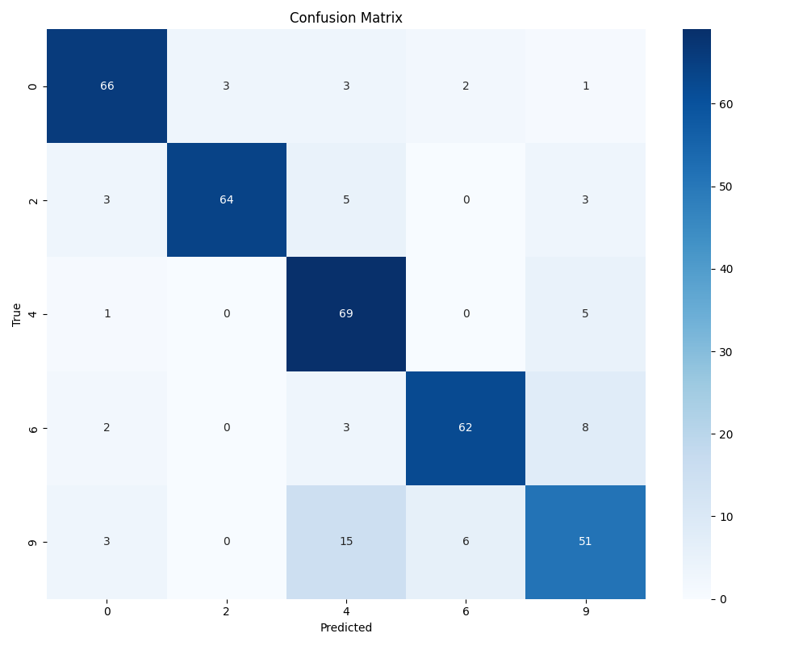

**Class‑wise Performance**

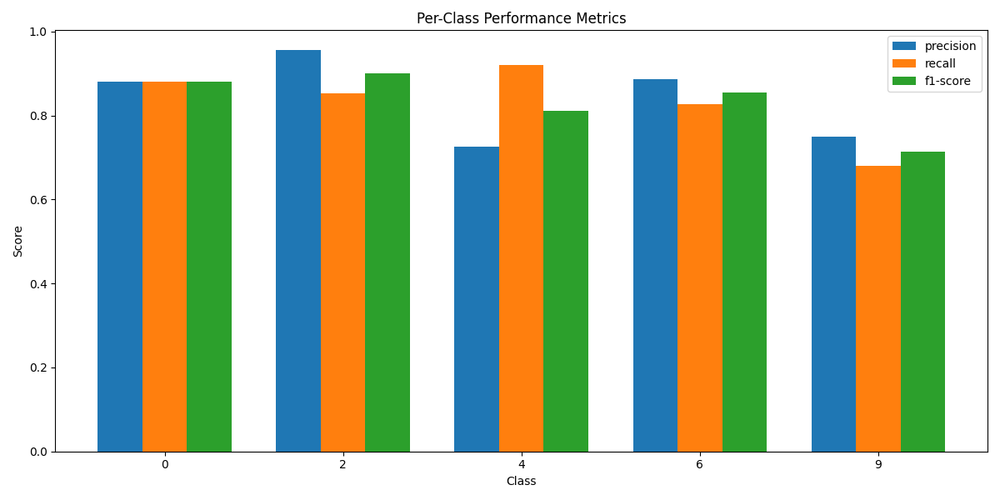

**Feature Importance (top coefficients)**

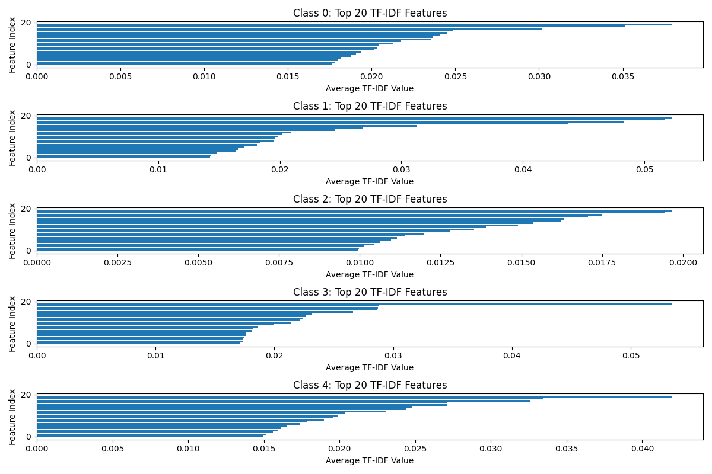

### Multimodal Model
- **Architecture**: Intermediate fusion approach combining image and text features
- **Image Branch**: EfficientNet-B0 pre-trained backbone
- **Text Branch**: TF-IDF features from best text model
- **Fusion Strategy**: Concatenation of features with MLP classification head
- **Training**: Progressive unfreezing, learning rate scheduling, early stopping

**Architecture Diagram**
```mermaid
graph TD

  subgraph Image Branch
    A[Input Image (224×224×3)] --> B("Pre-trained EfficientNet-B0")
    B --> C{Image Feature Vector}
  end

  subgraph Text Branch
    D[Input Text] --> E("TF-IDF Vectorizer")
    E --> F{Text Feature Vector}
  end

  C --> G[Concatenate]
  F --> G
  G --> H[Fusion MLP Head]
  H --> I[Output Logits (5 Classes)]

```

#### Performance

| Metric        | Score    |
|---------------|----------|
| **Accuracy**  | **91.47%** |
| **Macro F1**  | **0.9141** |

**Per-class results**

| Class | Precision | Recall | F1-Score |
|-------|-----------|--------|----------|
| 0     | 0.96      | 0.92   | 0.94     |
| 2     | 0.96      | 0.97   | 0.97     |
| 4     | 0.90      | 0.96   | 0.93     |
| 6     | 0.83      | 0.93   | 0.88     |
| 9     | 0.94      | 0.79   | 0.86     |

**Confusion Matrix (Test Set)**


**Normalized Confusion Matrix (Test Set)**

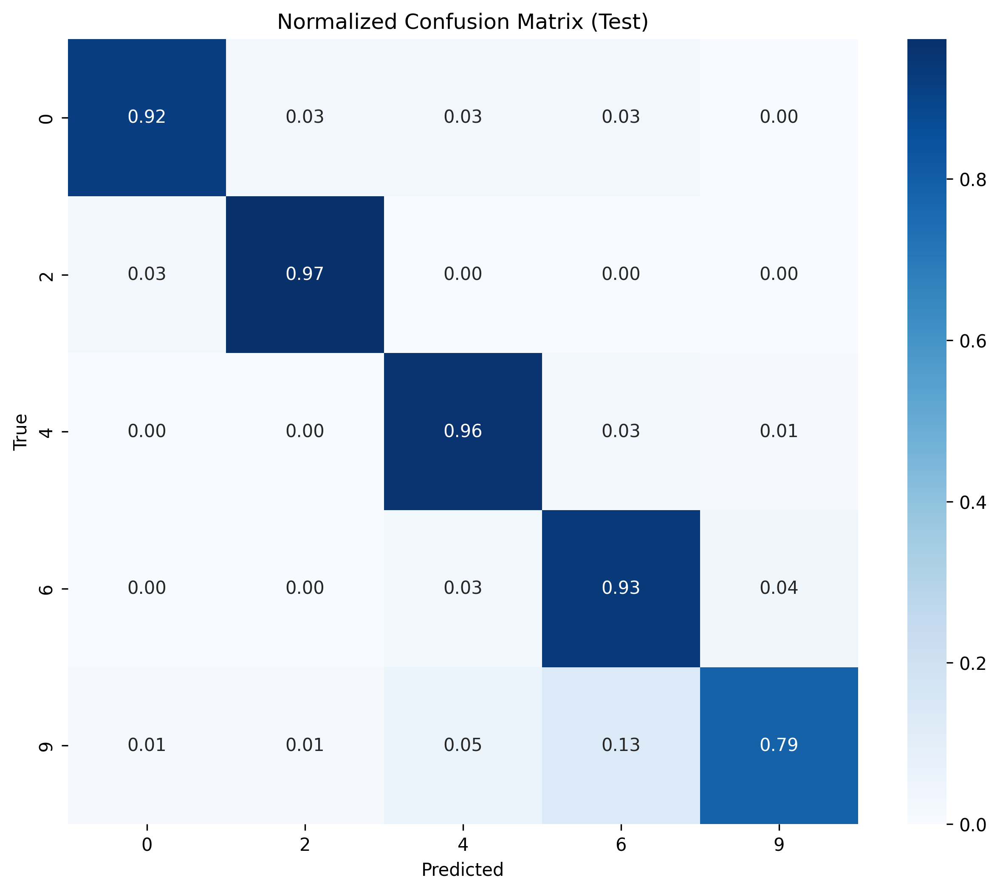

**Training History**

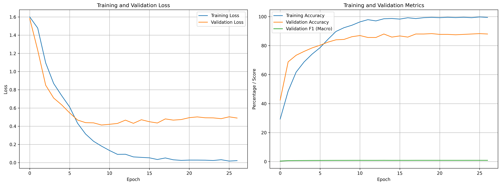

## Preprocessing Pipeline

### Image Preprocessing
- Resize to 224×224 pixels
- Convert to RGB (3 channels)
- Normalize with ImageNet mean & std
- On‑the‑fly augmentation during training (random rotation, flip, …)

### Text Preprocessing
- Tokenisation & lower‑casing
- Stop‑word removal
- Lemmatisation with spaCy

**Token Count Distribution**

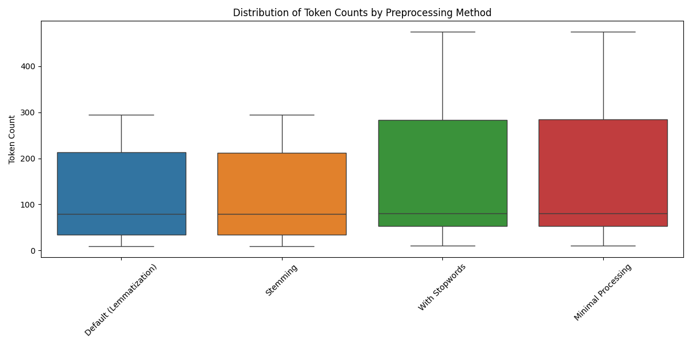

**Top Tokens by Frequency**

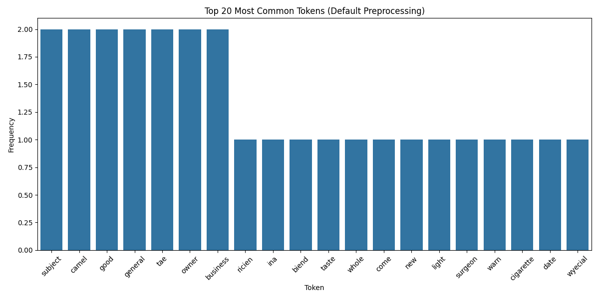

**Average Tokens per Class**

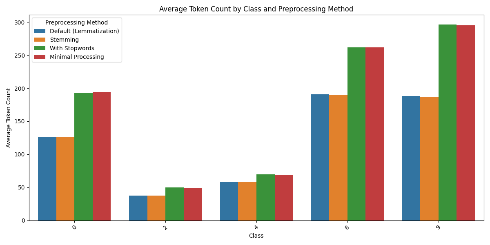

## Data Splitting
- **Strategy**: Stratified (70 % train • 15 % val • 15 % test)
- **Random Seed**: 42 for reproducibility

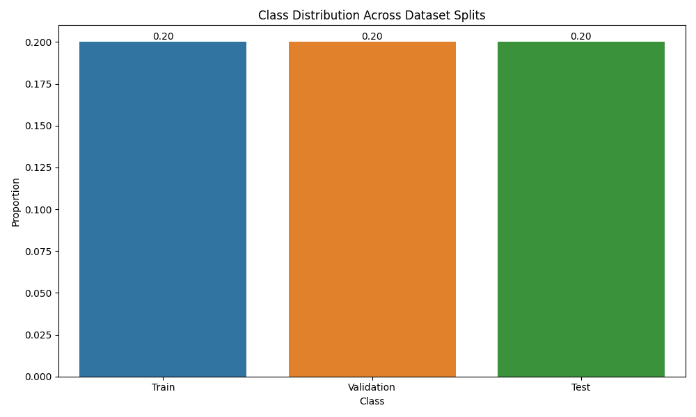

## Sample Documents

A few example pages after preprocessing:

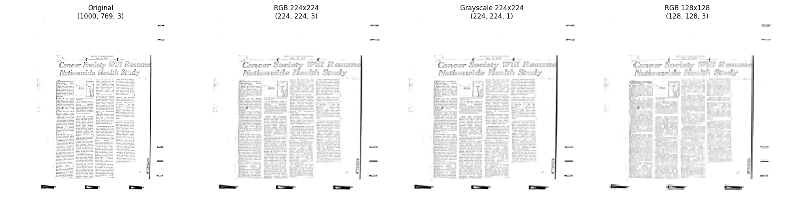
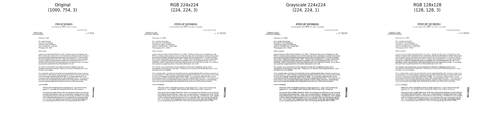
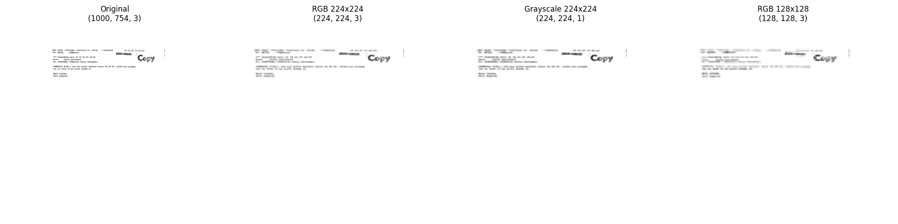

## Reproducibility
This project fixes seeds in data splitting, data loaders and training scripts to enable repeatable results. We recommend using the provided `requirements.txt` for the exact environment setup.

## Model Comparison and Conclusion

The performance of the three developed models on the test set is summarized below:

| Model              | Test Accuracy | Test Macro F1 | Key Features                               |
|--------------------|---------------|---------------|--------------------------------------------|
| **Image Baseline** | 81.33%        | 0.810         | EfficientNet-B0 (transfer learning)        |
| **Text Baseline**  | 83.20%        | 0.832         | Logistic Regression with TF-IDF features   |
| **Multimodal**     | **91.47%**    | **0.914**     | Fusion of Image (EfficientNet) & Text (TF-IDF) |

**Conclusion:**

Both baseline models achieved reasonable performance, with the text-based Logistic Regression model slightly outperforming the image-based EfficientNet model. This suggests that the OCR text contains significant discriminative information for this classification task.

The **multimodal model**, which combines features from both the image (using the pre-trained EfficientNet backbone) and the text (using TF-IDF features), achieved a **significant improvement** over both baselines. With a Test Accuracy of 91.47% and a Macro F1 score of 0.914, it demonstrates the benefit of leveraging both visual and textual information for classifying these document images. The fusion strategy effectively integrates the strengths of both modalities, leading to the best overall classification performance.

Further analysis of the multimodal model's per-class performance (see confusion matrix and metrics table above) shows strong results across most classes, although class 9 remains slightly more challenging compared to others, albeit with improved performance compared to the baselines.

